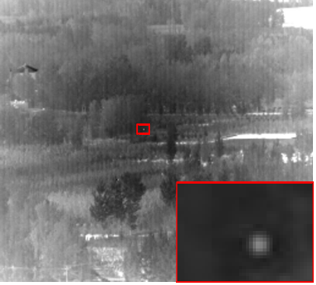

# 手写数字识别+MNIST数据库：Pytorch+python
本项目基于Pytorch和Python，用于手写数字识别和使用MNIST数据库进行数据训练。该项目提供了一个训练模型的示例，以及一个可以识别手写数字的简单应用程序。

# 环境要求
本项目运行需要以下环境：

Python 3.x
Pytorch 1.x

# 使用方法
在终端中进入该项目的根目录。
运行py后缀名文件，训练模型。
# 参考资料
深度学习框架PyTorch入门与实践
MNIST数据库官方网站

# 前后对比度图

